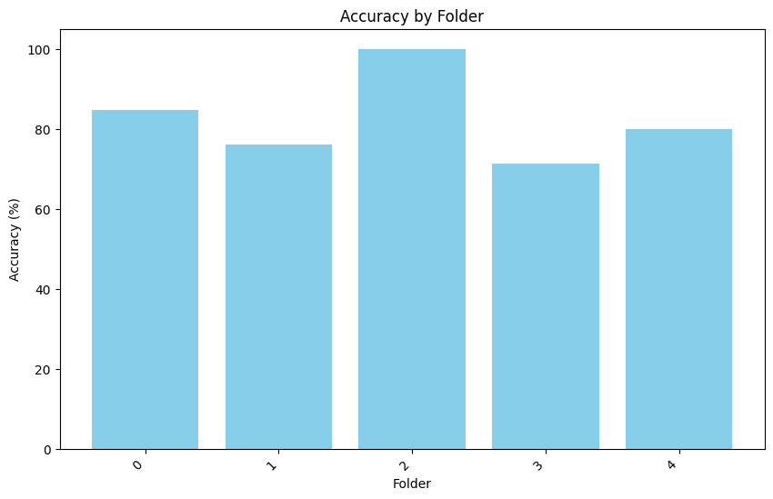
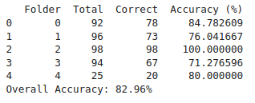

# A Quantitative Analysis of Severity Grading of Knee Osteoarthritis

## Authors
- **Asif Ihtemadul Haque**  
  Department of CSE, BUET  
  Email: [1805048@ugrad.cse.buet.ac.bd](mailto:1805048@ugrad.cse.buet.ac.bd)
  
- **Shamim Al Mamun**  
  Department of CSE, BUET  
  Email: [1805060@ugrad.cse.buet.ac.bd](mailto:1805060@ugrad.cse.buet.ac.bd)

## Supervisor
- **Dr. Mahmuda Naznin**  
  Department of CSE, BUET  
  Email: [mahmudanaznin@cse.buet.ac.bd](mailto:mahmudanaznin@cse.buet.ac.bd)

## Abstract
Knee osteoarthritis (OA) is a common condition traditionally assessed using the qualitative Kellgren-Lawrence (KL) grading system. To improve accuracy and objectivity, we developed a quantitative method for measuring the knee joint space between the tibia and femur from frontal X-ray images. Our approach utilizes Sobel and FastSAM edge detection algorithms, enhanced with simulated annealing and local smoothing techniques. This method is efficient, requiring minimal computational resources and no machine learning training. Preliminary results show that our method provides a reliable and precise tool for knee OA assessment, setting the stage for future clinical validation.

## Repository Structure

├── Assets/

│   ├── csv/

│   │   ├── joint_spaces_per_grade.csv

│   │   ├── point_distances.csv

│   │   ├── upper_edge_points.csv

│   │   ├── lower_edge_points.csv

│   │   └── test_output.csv

│   └── img/

│       ├── accuracy_by_folder.png

│       └── accuracy-table.png

├── Notebooks/

│   ├── 1-fastsam_dataset_generation.ipynb

│   ├── 2-fastsam_edge_detection.ipynb

│   ├── 3-quantitative-analysis.ipynb

│   └── 4-Accuracy.ipynb

## Datasets

### Raw Knee X-Ray Dataset

- **Source**: [Knee Osteoarthritis Dataset with Severity](https://www.kaggle.com/datasets/shashwatwork/knee-osteoarthritis-dataset-with-severity)
- **Description**: This dataset contains raw knee X-ray images labeled with the severity of osteoarthritis. It is useful for training models to classify the severity of the disease.

### Segmented Knee X-Ray Dataset

- **Source**: [Fast Segmented Knee X-Ray Dataset](https://www.kaggle.com/datasets/shamim2601/fast-segmented-knee-xray-dataset)
- **Description**: This dataset provides segmented knee X-ray images. It is useful for training models on segmentation tasks to identify specific regions of the knee.

## Workflow of the Thesis

1. **Apply Sobel operator on raw X-ray image and detect edges**
   - [Internal Notebook](Notebooks/3-quantitative-analysis.ipynb)
   - [External Kaggle Notebook](https://www.kaggle.com/code/shamim2601/quantitative-analysis-knee-oa)

2. **For better edge detection, generate segmented dataset using FastSAM model**
   - [Internal Notebook](Notebooks/1-fastsam_dataset_generation.ipynb)
   - [External Kaggle Notebook](https://colab.research.google.com/drive/1ELHU5pD5CtvHdl_NX2SofB7LC5iMXLzC)

3. **Run edge detection on segmented dataset and find points along upper edge, lower edge, and distance between the points**
   - [Internal Notebook](Notebooks/2-fastsam_edge_detection.ipynb)
   - [External Kaggle Notebook](https://www.kaggle.com/code/asifihtemadulhaque/thesis-fastsam)

4. **Superimpose points on the original image and find ROI on the left side and right side of the knee joint**
   - [Internal Notebook](Notebooks/3-quantitative-analysis.ipynb)
   - [External Kaggle Notebook](https://www.kaggle.com/code/shamim2601/quantitative-analysis-knee-oa)

5. **Through statistical analysis, find the most probable value of left_joint_space and right_joint_space for each image**
   - [Internal Notebook](Notebooks/3-quantitative-analysis.ipynb)
   - [External Kaggle Notebook](https://www.kaggle.com/code/shamim2601/quantitative-analysis-knee-oa)

6. **Through statistical analysis, find the most probable value of left_joint_space and right_joint_space for each grade in pixels and percentage**
   - [Internal Notebook](Notebooks/3-quantitative-analysis.ipynb)
   - [External Kaggle Notebook](https://www.kaggle.com/code/shamim2601/quantitative-analysis-knee-oa)

7. **Find the range of percentage of joint space for detection of osteoarthritis yes/no**
   - [Internal Notebook](Notebooks/4-Accuracy.ipynb)
   - [External Kaggle Notebook](https://colab.research.google.com/drive/1OrVyLM7AhsvR_HRyMl7N1mpeNg5Mp2Ok)

8. **Find the accuracy of osteoarthritis detection from the test dataset and show results**
   - [Internal Notebook](Notebooks/4-Accuracy.ipynb)
   - [External Kaggle Notebook](https://colab.research.google.com/drive/1OrVyLM7AhsvR_HRyMl7N1mpeNg5Mp2Ok)

## Accuracy Results

### Accuracy by Folder

### Accuracy Table

